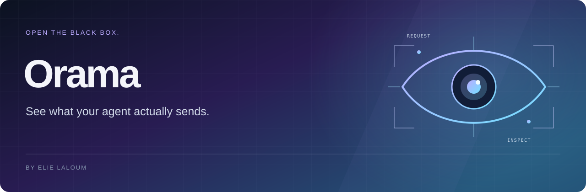
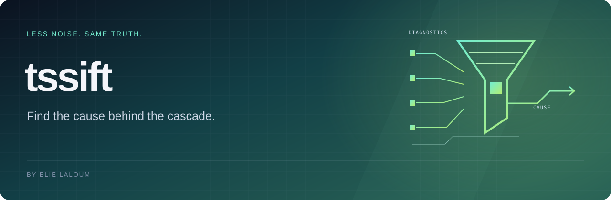
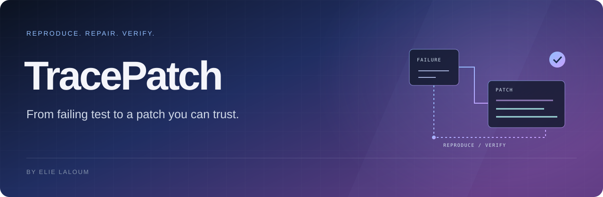

<a href="README.md">English</a>

Je suis **Elie Laloum**, développeur fullstack. J’aime construire de bout en bout : l’interface que l’on utilise, les services derrière et les détails qui font tenir l’ensemble.

Applications web, expérimentations, intégrations, parfois un outil pour faire disparaître un problème récurrent. Je suis les sujets qui m’intéressent, sans m’enfermer dans une spécialité.

## Quelques projets

**[Redline ↗](https://github.com/elie-laloum/redline)** — Transformer un ticket Jira en changements coordonnés entre plusieurs dépôts. Des agents Claude Code challengent le plan, développent dans l’ordre des dépendances et préparent les merge requests GitLab.

TypeScript · Claude Code · MCP &nbsp; · &nbsp; [Voir l’interface](https://github.com/elie-laloum/redline#see-it-in-action)

**[Orama ↗](https://github.com/elie-laloum/orama)** — Voir ce que l’agent envoie réellement : prompts système, outils déclarés, conversations et réponses dans un tableau de bord local.

Rust · React · TypeScript · SQLite &nbsp; · &nbsp; [Voir la démo](https://github.com/elie-laloum/orama#see-it-in-action)

**[tssift ↗](https://github.com/elie-laloum/tssift)** — Retrouver la cause commune derrière une cascade d’erreurs TypeScript, sans perdre les diagnostics d’origine.

TypeScript · Compiler API · CLI &nbsp; · &nbsp; [Voir la démo](https://github.com/elie-laloum/tssift#see-it-in-action)

**[FrameBudget ↗](https://github.com/elie-laloum/framebudget)** — Comparer les réglages d’encodage sur des scènes échantillonnées, choisir le compromis taille–qualité et vérifier le résultat.

Python · FFmpeg · VMAF &nbsp; · &nbsp; [Voir la démo](https://github.com/elie-laloum/framebudget#see-it-in-action)

**[TracePatch ↗](https://github.com/elie-laloum/tracepatch)** — Passer d’un test qui échoue à un correctif ciblé, accompagné des vérifications réellement exécutées.

TypeScript · Node.js · Git &nbsp; · &nbsp; [Voir la démo](https://github.com/elie-laloum/tracepatch#see-it-in-action)

---

Également : [BumpLab](https://github.com/elie-laloum/bumplab) · [QueryLedger](https://github.com/elie-laloum/queryledger).
