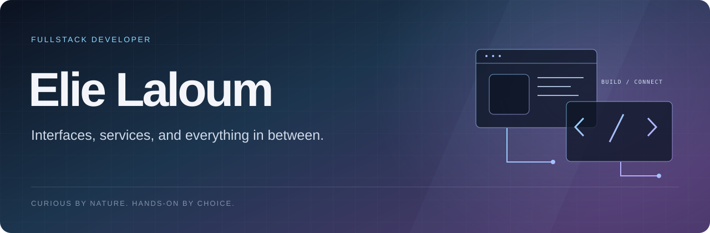
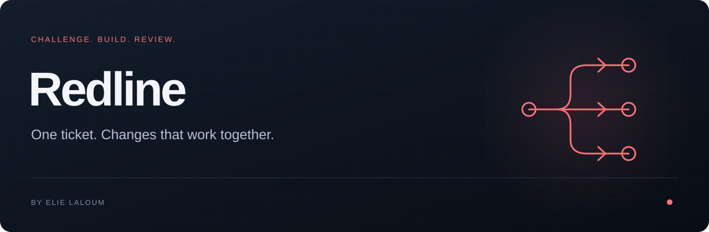

<a href="README.md">English</a>

Je suis **Elie Laloum**, développeur fullstack. J’aime construire de bout en bout : l’interface que l’on utilise, les services derrière et les détails qui font tenir l’ensemble.

Applications web, expérimentations, intégrations, parfois un outil pour faire disparaître un problème récurrent. Je suis les sujets qui m’intéressent, sans m’enfermer dans une spécialité.

## Quelques projets

**[Redline ↗](https://github.com/elie-laloum/redline)** — Transformer un ticket Jira en changements coordonnés entre plusieurs dépôts. Des agents Claude Code challengent le plan, développent dans l’ordre des dépendances et préparent les merge requests GitLab.

TypeScript · Claude Code · MCP &nbsp; · &nbsp; [Voir l’interface](https://github.com/elie-laloum/redline#see-it-in-action)

**[FrameBudget ↗](https://github.com/elie-laloum/framebudget)** — Comparer les réglages d’encodage avec des mesures de taille, de vitesse et de qualité, puis vérifier le fichier à conserver.

Python · FFmpeg · VMAF &nbsp; · &nbsp; [Voir la démo](https://github.com/elie-laloum/framebudget#see-it-in-action)

**[QueryLedger ↗](https://github.com/elie-laloum/queryledger)** — Détecter un N+1 dans les tests, avec un budget explicite de requêtes et un échec clair quand il est dépassé.

Ruby · Active Record · RSpec &nbsp; · &nbsp; [Voir la démo](https://github.com/elie-laloum/queryledger#see-it-in-action)

---

Également : [TracePatch](https://github.com/elie-laloum/tracepatch) et [BumpLab](https://github.com/elie-laloum/bumplab). [Tous les dépôts →](https://github.com/elie-laloum?tab=repositories)
