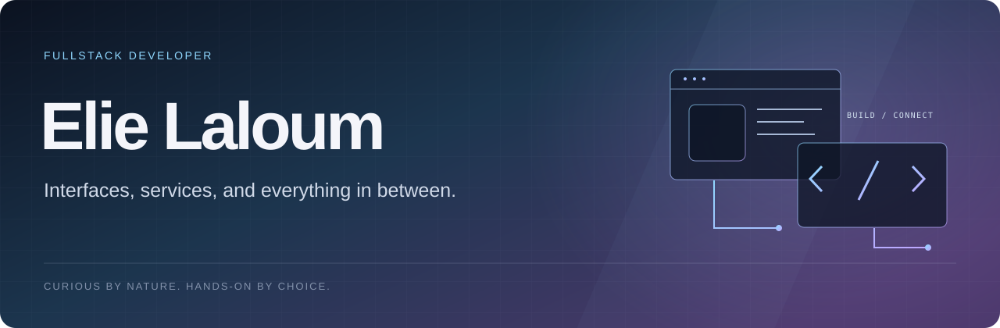

<a href="README.md">English</a>

Je suis **Elie Laloum**, développeur fullstack. Je construis des logiciels de bout en bout, de l’interface aux services qui la font fonctionner.

## Je développe Outpost

**[Outpost](https://github.com/elie-laloum/outpost)** est une bibliothèque TypeScript et un outil en ligne de commande pour exécuter des agents de code dans des environnements isolés et coordonner leur travail. Commencez par une tâche, puis ajoutez des tâches en parallèle, des boucles de vérification et des décisions humaines.

- **Choisissez l’agent et son environnement.** Associez vos agents à des conteneurs locaux ou à des environnements cloud.
- **Gardez les changements faciles à relire.** Travaillez dans des worktrees Git dédiés et récupérez les réponses, les commits et les données d’utilisation.
- **Composez votre workflow.** Reliez des tâches typées, fixez des budgets et prévoyez des étapes de validation humaine.

**[Découvrir la documentation ↗](https://elie-laloum.github.io/outpost/fr/)** · [GitHub](https://github.com/elie-laloum/outpost) · [GitLab](https://gitlab.elielaloum.com/elielaloum/outpost) · [npm](https://www.npmjs.com/package/@elie-laloum/outpost)

TypeScript · Node.js · MIT
