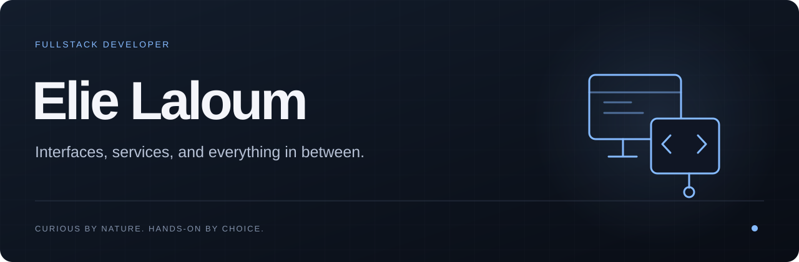
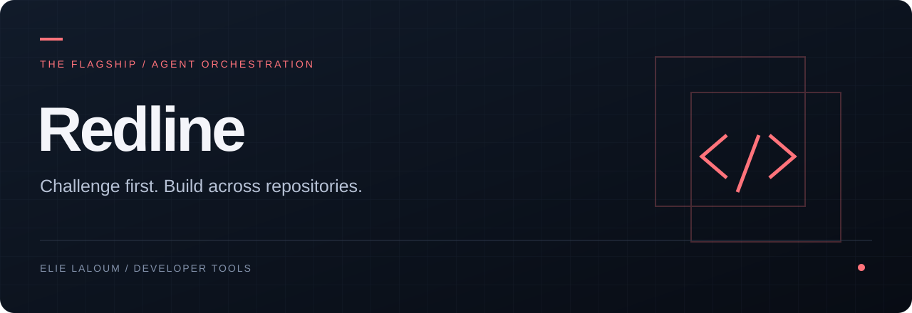
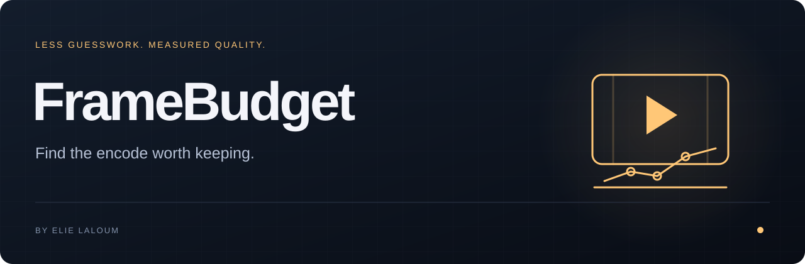
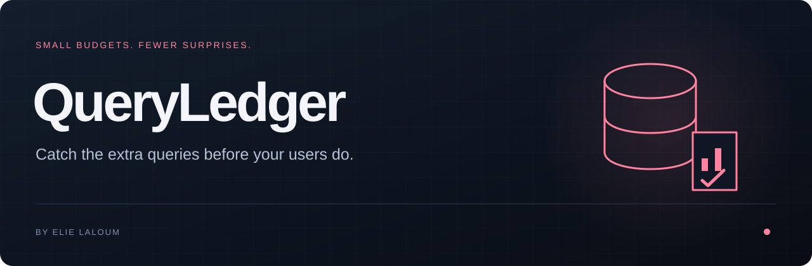

<a href="README.fr.md">Français</a>

I’m **Elie Laloum**, a fullstack developer. I enjoy building things end to end: the interface people use, the services behind it, and the details that make everything work together.

Web apps, experiments, integrations, and the occasional tool that makes a recurring problem disappear. I follow interesting problems wherever they lead.

## Selected projects

**[Redline ↗](https://github.com/elie-laloum/redline)** — Turn a Jira ticket into coordinated changes across repositories. Claude Code agents challenge the plan, build in dependency order, and prepare GitLab merge requests for review.

TypeScript · Claude Code · MCP &nbsp; · &nbsp; [Watch the interface](https://github.com/elie-laloum/redline#see-it-in-action)

**[FrameBudget ↗](https://github.com/elie-laloum/framebudget)** — Stop guessing your encoding settings. Compare size, speed and visual quality, then verify the file you keep.

Python · FFmpeg · VMAF &nbsp; · &nbsp; [Watch the demo](https://github.com/elie-laloum/framebudget#see-it-in-action)

**[QueryLedger ↗](https://github.com/elie-laloum/queryledger)** — Catch an N+1 where you can still fix it cheaply: in your tests. Give database queries an explicit budget and make regressions visible.

Ruby · Active Record · RSpec &nbsp; · &nbsp; [Watch the demo](https://github.com/elie-laloum/queryledger#see-it-in-action)

---

Also building [TracePatch](https://github.com/elie-laloum/tracepatch) and [BumpLab](https://github.com/elie-laloum/bumplab). [Explore all repositories →](https://github.com/elie-laloum?tab=repositories)
