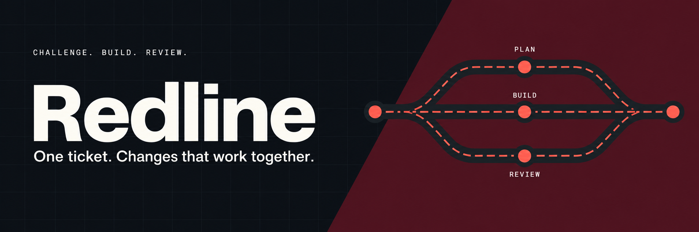
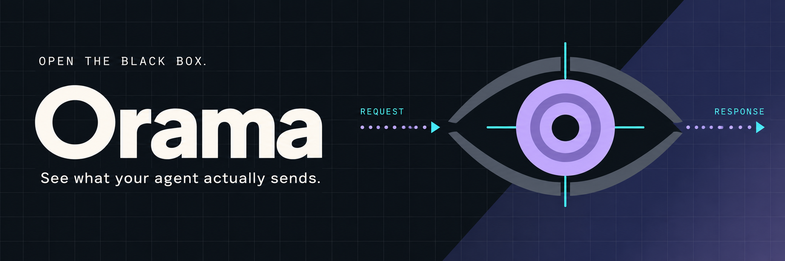
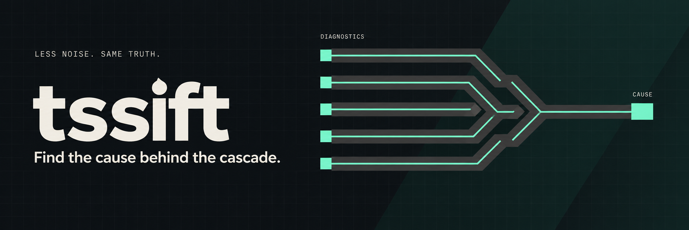
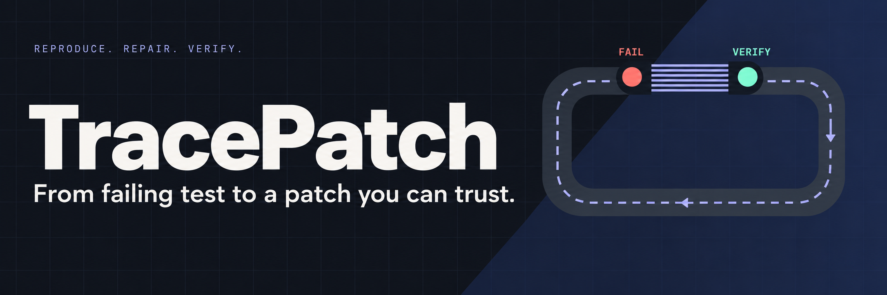

<a href="README.fr.md">Français</a>

I’m **Elie Laloum**, a fullstack developer. I enjoy building things end to end: the interface people use, the services behind it, and the details that make everything work together.

Web apps, experiments, integrations, and the occasional tool that makes a recurring problem disappear. I follow interesting problems wherever they lead.

## Selected projects

**[Redline ↗](https://github.com/elie-laloum/redline)** — Turn a Jira ticket into coordinated changes across repositories. Claude Code agents challenge the plan, build in dependency order, and prepare GitLab merge requests for review.

TypeScript · Claude Code · MCP &nbsp; · &nbsp; [Watch the interface](https://github.com/elie-laloum/redline#see-it-in-action)

**[Orama ↗](https://github.com/elie-laloum/orama)** — See what a coding agent actually sends: system prompts, tool declarations, conversations and responses in a local dashboard.

Rust · React · TypeScript · SQLite &nbsp; · &nbsp; [Watch the demo](https://github.com/elie-laloum/orama#see-it-in-action)

**[tssift ↗](https://github.com/elie-laloum/tssift)** — Find the shared cause behind a cascade of TypeScript errors, while keeping the original diagnostics available.

TypeScript · Compiler API · CLI &nbsp; · &nbsp; [Watch the demo](https://github.com/elie-laloum/tssift#see-it-in-action)

**[FrameBudget ↗](https://github.com/elie-laloum/framebudget)** — Compare encodes on sampled scenes, choose a measured size–quality tradeoff, and verify the result.

Python · FFmpeg · VMAF &nbsp; · &nbsp; [Watch the demo](https://github.com/elie-laloum/framebudget#see-it-in-action)

**[TracePatch ↗](https://github.com/elie-laloum/tracepatch)** — Turn a reproduced test failure into a focused patch backed by the checks that actually ran.

TypeScript · Node.js · Git &nbsp; · &nbsp; [Watch the demo](https://github.com/elie-laloum/tracepatch#see-it-in-action)

---

Also building [BumpLab](https://github.com/elie-laloum/bumplab) · [QueryLedger](https://github.com/elie-laloum/queryledger).
